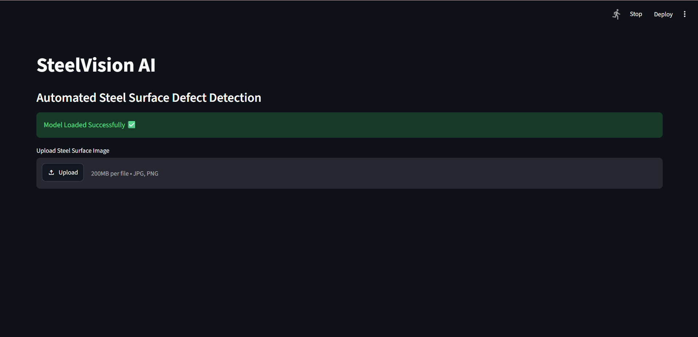
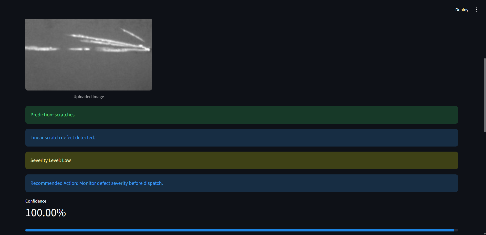
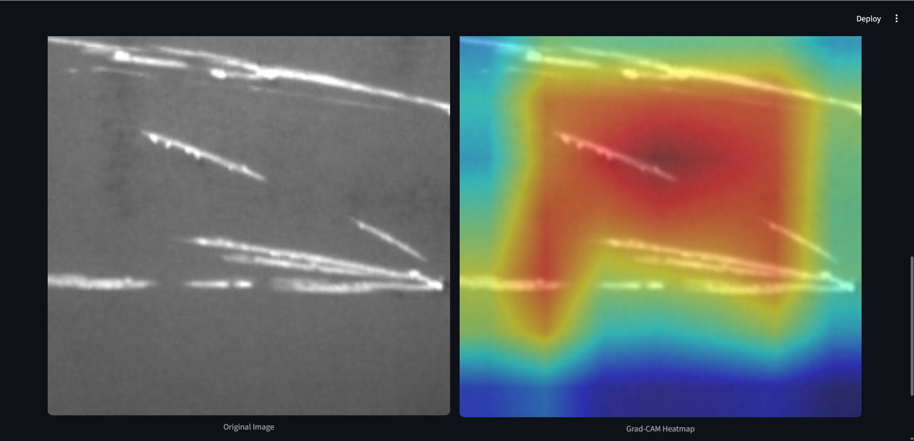
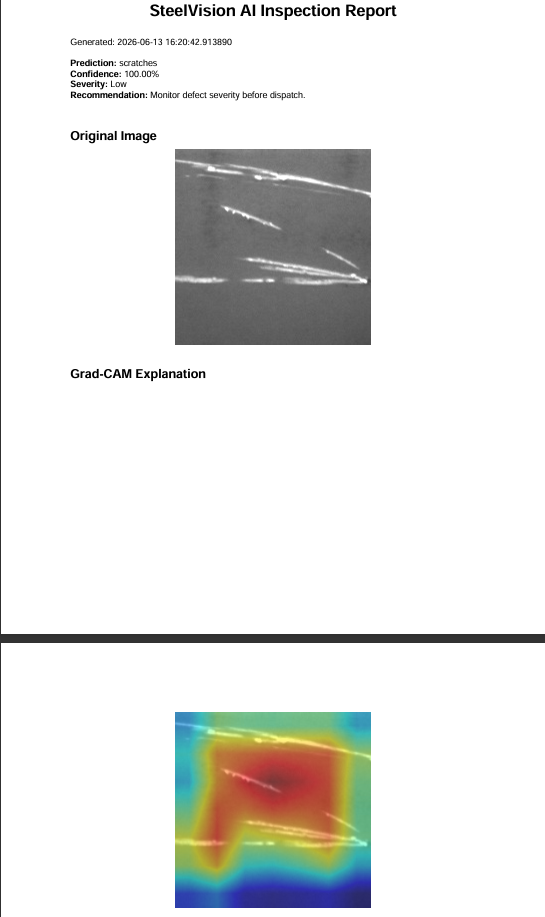

#  SteelVision AI

An Explainable AI-powered Industrial Inspection System for Automated Steel Surface Defect Detection using ResNet18, Grad-CAM, and Streamlit.

---

##  Project Highlights

- Built an end-to-end industrial defect inspection system
- Achieved automated classification of 6 steel defect categories
- Implemented Explainable AI using Grad-CAM
- Developed severity assessment and recommendation engine
- Generated downloadable inspection reports with visual evidence
- Deployed through Streamlit


##  Demo Video

See SteelVision AI in action:

[](https://drive.google.com/file/d/1yqfAvWbR_UBHennfMuYQovwnprPU_ow7/view?usp=sharing)

📹 Full demonstration covering:

- Steel Surface Defect Detection
- Grad-CAM Explainability
- Confidence Analysis
- Severity Assessment
- PDF Inspection Report Generation


##  Features

- Automated Steel Surface Defect Detection
- Explainable AI using Grad-CAM
- Confidence Score Analysis
- Defect Severity Assessment
- Corrective Action Recommendations
- PDF Inspection Report Generation
- Invalid Image Detection
- Interactive Streamlit Web Application

---

##  Application Screenshots

### Homepage


---

### Prediction Dashboard



---

### Grad-CAM Explainability



---

### Inspection Report



---

##  System Workflow

Image Upload

↓

Preprocessing

↓

ResNet18 Classification

↓

Confidence Analysis

↓

Grad-CAM Explainability

↓

Severity Assessment

↓

PDF Report Generation

---

##  Model Information

| Component | Details |
|------------|------------|
| Architecture | ResNet18 |
| Classes | 6 Defect Types |
| Framework | PyTorch |
| Explainability | Grad-CAM |
| Deployment | Streamlit |
| Language | Python |

---

##  Repository Structure

```text
assets/
notebooks/
presentation/
README.md
requirements.txt
```

---

##  Installation

```bash
git clone https://github.com/Venkatesh1410/SteelVision-AI.git

cd SteelVision-AI

pip install -r requirements.txt

streamlit run app.py
```

---

##  License

MIT License

---

##  Author

Venkatesh Mishra

Computer Vision • Machine Learning • Explainable AI
