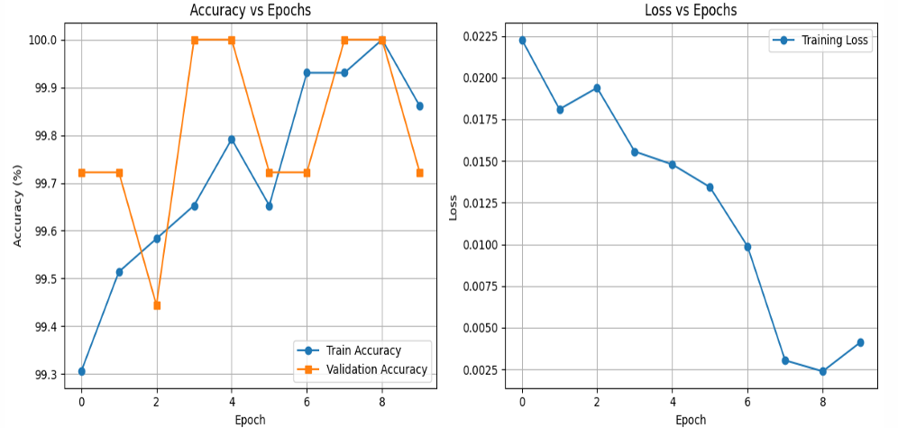
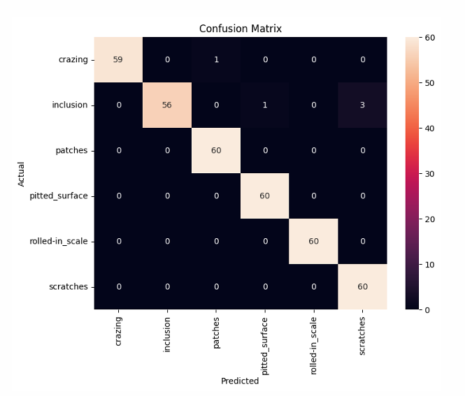
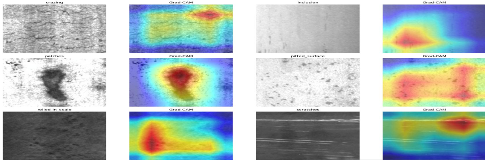

# SteelVision AI

Explainable Computer Vision for Automated Steel Surface Defect Inspection using Deep Learning and Grad-CAM.

## Overview

SteelVision AI is an industrial computer vision system developed for automated steel surface defect inspection.

The project uses a fine-tuned ResNet18 model to classify six categories of steel defects and incorporates Grad-CAM visualizations to provide explainable predictions.

## Key Results

- Validation Accuracy: 98.61%
- Macro F1 Score: 98.60%
- 6 Defect Classes
- Explainable AI using Grad-CAM
- Industrial Deployment Architecture

## Model Performance

### Validation Metrics

| Metric | Score |
|----------|----------|
| Accuracy | 98.61% |
| Macro F1 Score | 98.60% |

### Training Curves

### Confusion Matrix

### Explainable AI (Grad-CAM)

## Defect Classes

1. Crazing
2. Inclusion
3. Patches
4. Pitted Surface
5. Rolled-In Scale
6. Scratches

## Dataset

NEU Surface Defect Dataset

- Total Images: 1800
- Training Images: 1440
- Validation Images: 360

## Model

- Architecture: ResNet18
- Framework: PyTorch
- Explainability: Grad-CAM
- Classification Type: Multi-Class Classification

## Industrial Use Case

The system is designed for real-time steel quality inspection and can be integrated with:

- Industrial Cameras
- Edge Devices
- Operator Dashboards
- Manufacturing Quality Systems

## Repository Contents

- Jupyter Notebook Implementation
- Project Presentation
- Training Pipeline
- Evaluation Results
- Explainable AI Analysis

## Author

Venkatesh Mishra

B.Tech Mechanical Engineering

Indian Institute of Technology Patna
